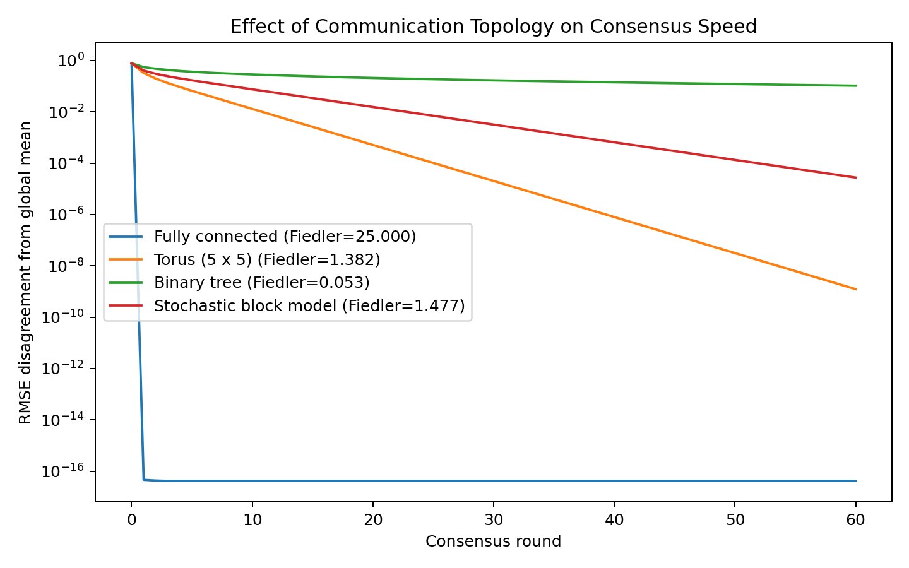
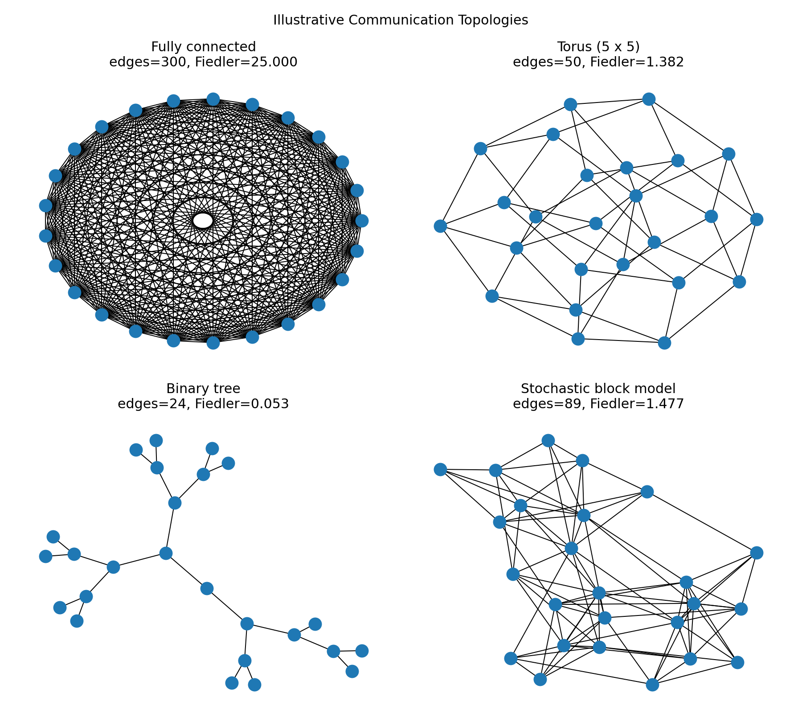

# Decentralized Deep Learning & Communication Topologies

**Research showcase from the UC Santa Cruz Science Internship Program (SIP)**

This repository documents my research experience studying **decentralized deep learning and structured communication topologies** through the UC Santa Cruz Science Internship Program.

I worked on a three-person research team under PhD mentorship, using Python and PyTorch to investigate how communication structure can affect distributed learning systems.

> **Repository note:** The underlying STRUDEL research platform is maintained in a private collaborative repository. This public repository does **not** reproduce private STRUDEL source code, experimental configurations, unpublished files, or restricted research materials. The code here consists of separate public demonstrations created after the research project to illustrate concepts I worked with.

## Research Question

In decentralized learning, participating agents exchange information directly with other agents rather than relying entirely on a central server.

Our work investigated a central systems question:

**How does the communication topology connecting those agents influence connectivity, information flow, and decentralized learning performance?**

Instead of treating network structure as simply an implementation detail, we studied it as an experimental variable.

## My Role

As a student research intern, I:

* Conducted decentralized-learning experiments using **Python and PyTorch**
* Worked with structured communication graphs connecting multiple learning agents
* Compared network topologies and their connectivity properties
* Analyzed experimental results and model behavior
* Helped document methods, findings, and architecture comparisons for a research manuscript
* Collaborated with a PhD mentor and a three-person student research team

## Communication Topologies

Our research considered network structures including:

* **Fully Connected**
* **Torus**
* **Tree**
* **Butterfly**
* **Stochastic Block Model (SBM)**

Different topologies create different tradeoffs between communication cost, network connectivity, and the ability of information to propagate throughout a decentralized system.

## Graph Connectivity

One quantity we examined was the **Fiedler value**, the second-smallest eigenvalue of a graph's Laplacian matrix.

The Fiedler value provides a quantitative measure related to algebraic connectivity. In general, a larger value indicates stronger graph connectivity.

In one 25-client topology comparison from our research, we observed approximately:

| Topology  |                         Fiedler Value |
| --------- | ------------------------------------: |
| Torus     |                                 1.382 |
| Butterfly |                                 0.238 |
| Tree      |                                0.0535 |
| SBM       | ~0.51–0.98 depending on configuration |

These comparisons helped us reason about the relationship between sparse communication structures and network connectivity.

## Experimental Context

The research used the **STRUDEL** experimental platform for structured federated and decentralized learning.

My experience involved concepts including:

* Multi-agent learning systems
* Decentralized communication
* Structured network topologies
* Neural-network training
* Image-classification experiments
* Distributed data partitions
* Quantitative comparison of communication structures

---

# Public Demonstrations

The following programs were created as **public explanatory demonstrations after the research project**. They illustrate technical ideas related to my research without exposing the private STRUDEL implementation or experimental configuration.

## 1. Topology Metrics

[`topology_metrics_demo.py`](./topology_metrics_demo.py) provides a compact introduction to communication-topology analysis.

It constructs example networks and calculates:

* Number of nodes and edges
* Average degree
* Graph Laplacian eigenvalues
* Fiedler value

## 2. Reusable Graph Utilities

[`topology_utils.py`](./topology_utils.py) contains reusable utilities for constructing and analyzing several example communication networks.

The public demonstrations include:

* Fully connected networks
* 2D torus networks
* Binary trees
* Illustrative stochastic block models

It also calculates graph characteristics including density, diameter, average shortest-path length, and algebraic connectivity.

## 3. Decentralized Consensus Simulation

[`decentralized_consensus_demo.py`](./decentralized_consensus_demo.py) demonstrates why communication topology matters even in a simple distributed system.

Each node begins with its own value and communicates only with its graph neighbors. Using a Metropolis-style consensus matrix, the nodes repeatedly exchange information and move toward the network-wide average.

The simulation compares how quickly different communication structures reduce disagreement between nodes.

### Example Output



The visualization shows that network structure can substantially affect the rate at which information propagates through a decentralized system.

The raw generated values are available in [`consensus_results.csv`](./consensus_results.csv).

## 4. Topology Visualization

[`visualize_topologies.py`](./visualize_topologies.py) generates visual representations of the example communication networks.



These networks are illustrative public examples and should not be interpreted as exact copies of private STRUDEL experimental configurations.

## 5. Tests

[`test_topology_utils.py`](./test_topology_utils.py) contains basic automated checks for the public graph utilities, including:

* Tree structure validation
* Torus node-degree validation
* Expected Fiedler values for known example networks

---

## Reproducing the Public Demos

Install the dependencies:

```bash
pip install -r requirements.txt
```

Run the topology metrics demo:

```bash
python topology_metrics_demo.py
```

Run the decentralized consensus experiment:

```bash
python decentralized_consensus_demo.py
```

Generate the topology visualization:

```bash
python visualize_topologies.py
```

Run the tests:

```bash
pytest -q
```

## Important Distinction Between Research Results and Public Demos

The numerical research results reported earlier in this README came from my work with the private STRUDEL research environment.

The stochastic block model parameters, consensus experiment, graph layouts, and other configurations in the **public demonstration code are illustrative**. They were created separately for this portfolio and are not intended to reproduce unpublished STRUDEL experiments.

## What I Learned

This project changed how I think about machine-learning systems.

Model architecture is only one component of a distributed ML system. Performance can also depend on:

* How data is distributed
* Which agents communicate
* How information propagates through the network
* The optimization procedure
* The communication cost required to coordinate learning

The project gave me experience moving from simply **building models** to asking and experimentally investigating **research questions about machine-learning systems**.

## Technologies & Concepts

`Python` · `PyTorch` · `NumPy` · `NetworkX` · `Decentralized Learning` · `Federated Learning` · `Deep Learning` · `Graph Theory` · `Network Topology` · `Experimental Design` · `Model Evaluation`

## About This Repository

This repository serves as a **public research portfolio** documenting my experience with decentralized machine-learning research.

The actual STRUDEL source code remains in its private collaborative research repository. This showcase is intended to explain the research problem, my contribution, the technical concepts I worked with, and related concepts through separately created public demonstrations.
